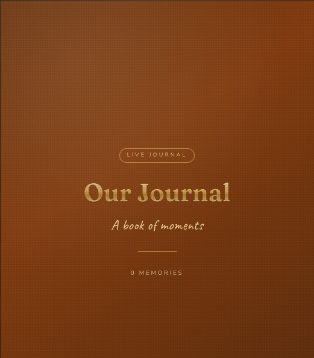

# 📖 Live Journal

> A living photo book you fill by texting a Telegram bot. Add a memory — a date, a few words, up to three photos — and it appears in a flip-through digital photo book you can export to HTML or print to PDF.


<p align="center">
  
</p>

## What it is

You take a photo of a moment worth keeping — your kid's first birthday, a trip, an ordinary good day. You send it to a private Telegram bot with a date and a sentence. The bot files it away, and your **Live Journal** — a web page that looks and flips like a real photo book — updates itself. When you want to share or archive it, export the whole thing as a self-contained HTML file or save it as a PDF.

The book is generated programmatically from a timeline, so it grows on its own as you add memories. No editing, no layout fiddling.

## Features

- 🤖 **Add memories by Telegram** — a guided chat: title → date → description → up to 3 photos → done.
- 📖 **Real photo-book feel** — page-flip interactions, a gold-foil hardcover, paper texture, handwritten dates.
- ⏳ **Chronological & automatic** — entries arrange themselves on a timeline; the book regenerates as you add to it.
- 🖨️ **Export anytime** — download a self-contained **HTML** file (photos embedded) or **Save as PDF**.
- 🔒 **Private by design** — photos live in a private bucket served via short-lived signed URLs; an optional site password gates the whole book.
- ☁️ **One deploy** — the book *and* the bot run in a single Vercel deployment. Nothing always-on to babysit.

## How it works

```
Telegram  ──▶  /api/telegram/webhook  ──▶  Supabase
 (you)          (Next.js route)            ├─ Postgres: journal_entries
                                           └─ Storage:  journal-photos (private)
                                                  │
        Web photo book  ◀── signed URLs ──────────┘
        (server-rendered, force-dynamic)
                │
        Export ─┴─▶  HTML (base64-embedded)  ·  /print → Save as PDF
```

Everything server-side uses the Supabase `service_role` key (which bypasses RLS); the tables have **RLS enabled with no policies**, so nothing is reachable with the public key. See [`CODEBASE.md`](CODEBASE.md) for the full map.

## Quick start

### 1. Supabase

Create a Supabase project (or reuse one), then provision the schema. The repo expects:

- tables `journal_entries`, `journal_bot_drafts` + the `journal_append_draft_photo` function (RLS on, no policies)
- a **private** storage bucket named `journal-photos`

Grab your **Project URL** and **`service_role` secret** from *Project Settings → API*.

### 2. Telegram bot

Message [@BotFather](https://t.me/BotFather) → `/newbot` → copy the token. Note the bot's `@username`.

### 3. Configure & run

```bash
cp .env.example .env.local   # fill in the values (comments explain each one)
npm install
npm run seed                 # optional: a few sample memories to preview the book
npm run dev                  # http://localhost:3000
```

Generate a webhook secret with `openssl rand -hex 32` for `TELEGRAM_WEBHOOK_SECRET`.

### 4. Deploy (Vercel)

```bash
vercel            # first deploy (creates the project)
vercel --prod     # production deploy
```

Set every variable from `.env.example` in the Vercel project (Settings → Environment Variables), point `NEXT_PUBLIC_SITE_URL` at your deploy URL, then register the bot's webhook:

```bash
npm run set-webhook -- https://your-app.vercel.app
```

## Using the bot

| Step | You send | Bot does |
|------|----------|----------|
| Start | `/new` | begins a new memory |
| 1 | a title | saves it |
| 2 | `2026-06-30` or `/today` | sets the date |
| 3 | a sentence or `/skip` | adds a description |
| 4 | up to 3 photos | stores them |
| 5 | `/done` | publishes it to your book |

`/cancel` discards the in-progress memory; `/help` shows the flow. Lock the bot to yourself by setting `TELEGRAM_ALLOWED_CHAT_IDS` to your chat id (the bot tells you yours).

## Exports

- **HTML** — the *HTML* button downloads one self-contained file with every photo embedded as base64. Works offline; easy to share or archive.
- **PDF** — the *PDF* button opens a print-optimized view; use your browser's **Save as PDF**.

## Configuration

All configuration is via environment variables — see [`.env.example`](.env.example) for the annotated list. Notable optional ones:

- `SITE_PASSWORD` — if set, the whole site requires this password (HTTP Basic auth).
- `JOURNAL_TITLE` / `JOURNAL_SUBTITLE` — cover text.
- `JOURNAL_TIMEZONE` — used for `/today` and date display (default `Asia/Singapore`).
- `JOURNAL_BOT_USERNAME` — adds an "Add a memory" link to the book.

## Tech stack

Next.js 16 (App Router, React 19) · Supabase (Postgres + Storage) · Tailwind CSS v4 · react-pageflip · Framer Motion · Telegram Bot API · Vercel.

## Contributing

Contributions are welcome! Please open an issue first to discuss what you'd like to change.

1. Fork the repo
2. Create a feature branch (`git checkout -b feature/your-feature`)
3. Commit your changes (`git commit -m 'feat: describe change'`)
4. Push and open a pull request

Please make sure `npm run lint` and `npm run build` pass before submitting a PR.

## Code of Conduct

This project follows the [Contributor Covenant v2.1](https://www.contributor-covenant.org/version/2/1/code_of_conduct/). By participating you agree to uphold a welcoming, harassment-free environment.

## License

Distributed under the MIT License. See [LICENSE](LICENSE) for details.

## Acknowledgements

Page-flip by [react-pageflip](https://github.com/Nodlik/react-pageflip) · fonts [Fraunces](https://fonts.google.com/specimen/Fraunces), [Nunito Sans](https://fonts.google.com/specimen/Nunito+Sans), and [Caveat](https://fonts.google.com/specimen/Caveat) · built with [Claude Code](https://claude.com/claude-code).
